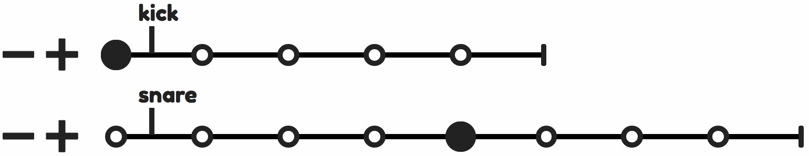

# Beadz Drum Machine

**Beadz** is an experimental drum machine built using The Web Audio API and Vue.js. It uses service worker and a `manifest.json` so that it can be saved to your device's homescreen and used offline. Get the **Beadz** web app here: [heydon.github.io/beadz-drum-machine/](https://heydon.github.io/beadz-drum-machine/).

## Polymeters

**Beadz** lets you create dynamic polymetric drum patterns by adding and removing quarter-beats from individual tracks while the composition is playing.

The greater the disparity between the (quarter-beat) length of individual tracks, the more complex and longer the composition.

## Quantum playback

**Beadz** also lets you adjust the probability that any individual track's sounds will be played. By calibrating which beats _can_ be played and the probability that they _will_ be played within a polymetric composition can give the illusion of a drummer improvising.

## Overrides

Some drums are not typically played at the same time as others within conventional drum beats. By allowing you to prioritize certain sounds over others, you can make sure collisions don't take place as polymetric track relationships permutate over time.

For example, by default the 'snare' and 'snare light' tracks are set to override the 'kick' track. Where a kick beat is scheduled but no snare sounds are due at the same time, the kick sound is played. Also, since 'snare' and 'snare light' represent sounds coming from the same drum, 'snare' overrides 'snare light'.

## Fluctuation

Real drummers do not produce exactly the same sound each time they hit a drum. Minor differences in velocity and the precise placement of the hit result in subtly different sounds.

**Beadz** emulates this variability by randomly altering the pitch of the triggered sound within close parameters. The level of fluctuation is adjustable for each track.

(**Note:** Safari does not support this feature because Safari is a thrice-used prophylactic.)

## Accessibility

**Beadz** has been designed to be operable using a keyboard and/or screen reader. If you have any problems using **Beadz**, please create an issue.
